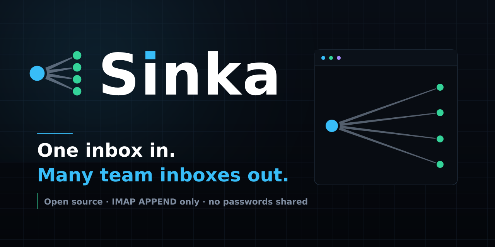

<p align="center"></p>

# Sinka — one inbox in, many team inboxes out

Sinka reads one Gmail inbox you already use and files a byte-exact copy of every new
message into each team member's own inbox. Nothing is forwarded, nobody shares a
mailbox password, and everyone reads their mail where they already read it.

- It reads the mail in one inbox you control.
- It files an identical copy into every team inbox you list.
- It shows you on one page whether that is really happening.

**Sinka is an open-source alternative to Gmailify, running the other way.** Gmailify
pulls many addresses into *one* Gmail account; Sinka fans *one* inbox out to *many*.

[](https://github.com/janasco/sinka/actions/workflows/ci.yml)
[](https://github.com/janasco/sinka/blob/main/LICENSE)
[](https://nodejs.org)



*The dashboard is a single page: a verdict line, the source inbox, one tile per team inbox, and the buttons you need. See [The dashboard, in short](#the-dashboard-in-short) below.*

## Why Sinka

Copying a message is not the same as forwarding one. Sinka files the raw bytes straight
into each inbox over IMAP, the same thing Thunderbird does when you drag a message
between accounts. Because nothing is ever sent as mail, there is no daily sending cap
to hit, and signatures and stamps (DKIM/SPF) stay exactly as their sender wrote them.

### Sinka vs Gmailify

Different job, not strictly better or worse — pick the one that matches how your team reads mail.

| | Sinka | Gmailify |
| --- | --- | --- |
| Setup model | A list of inboxes your team already has. Sinka signs in to each one with its own App Password. | One inbox collecting mail from many addresses, or a catch-all on a domain. |
| Which way mail moves | Fan-out: one inbox to many inboxes. | Fan-in: many addresses to one inbox. |
| Who reads the mail | Each person reads their own inbox, with their own replies, history and rules. | People share access to the one collecting inbox, or its owner passes mail onward by rule. |
| Password sharing | One App Password per inbox. No shared mailbox to hand around. | The collecting account is the one everyone trusts, so access to it is shared. |
| Sending limits | Never sends, so no send cap and no re-signing. | Re-forwarding or sending as an address can hit Gmail's daily send cap. |
| What tends to break | A revoked App Password. That one inbox is flagged; the rest carry on. | One account filling up, or one account being the single point of failure. |
| Domain mail | Just list your real team addresses. | A domain usually wants a catch-all so nothing is missed. |

## What it does when you install it

1. **It checks the source inbox on its own timer** — every 5 minutes out of the box — signing in over IMAP and looking for unread mail.
2. **For each new message it files a copy into every active team inbox.** The bytes are stored as they arrived. Nothing is forwarded, nothing is re-sent, and the original stays where it is.
3. **Automatic replies and delivery notices are skipped**, so a failed copy never bounces around the team.
4. **It writes down every message it has filed** (in `data/seen.json` locally, in a D1 table on the edge), so a restart or a re-check never files the same letter twice.
5. **A refused copy is retried, then flagged.** One bad App Password holds up that one inbox, not the others: the copy waits and is tried again on later checks, up to 5 times. Three refusals in a row pauses that inbox, and a successful test copy turns it back on. Anything still failing after 5 tries is written to `data/failures.log` rather than lost quietly.
6. **The dashboard tells you the truth.** A number only appears when the real thing happened. If the page cannot reach Sinka, it says so and freezes the numbers instead of leaving stale ones looking live.

```
   source inbox                   Sinka                      team inboxes
  ┌──────────────────┐       ┌────────────────────┐       ┌──────────────────────────┐
  │ you@example.com  │       │  reads new mail    │       │ team-a@example.com       │
  │                  │──────▶│  over IMAP, then   │──────▶│ team-b@example.com       │
  │  one inbox,      │       │  files the same    │       │ ...                      │
  │  yours           │       │  bytes into every  │       │ team-j@example.com       │
  └──────────────────┘       │  inbox with IMAP   │       └──────────────────────────┘
                             │  APPEND            │
                             └────────────────────┘
```

## Requirements

- **Node.js 20 or newer** — `node --version` should print `v20` or higher. npm comes with it.
- **Every inbox that takes part** — the source plus each team inbox — with IMAP on (Gmail Settings > See all settings > Forwarding and POP/IMAP) and its own App Password (2-Step Verification on, then Google Account > Security > App passwords).
- **For the edge only:** a Cloudflare account on the **Workers Paid** plan, because Containers require it.

## Quick start

Two things to get first, for every inbox: IMAP turned on, and one App Password of its
own. An App Password is a single 16-character code Google gives one app, so it can sign
in without your real password — revoke it any time from the same page, and nothing
else stops working.

**Step 1 — get the code and install its pieces.**

```bash
git clone https://github.com/janasco/sinka.git
cd sinka
npm install
```

**Step 2 — write your own private settings.**

```bash
cp .env.example .env
```

Open `.env` in any text editor and fill in three keys: `GMAIL_USER` (your source inbox),
`GMAIL_APP_PASSWORD` (that inbox's App Password), and `DEST_SINKS` — one
`address:app-password` pair per team inbox, joined with `;`. Put a `-` in front of an
address to pause it without losing its password.

**Step 3 — check it before you trust it.**

```bash
npm run check      # makes sure the files have no typos
npm run poll-once  # checks mail once and stops — safe to test
```

**Step 4 — run it.**

```bash
npm start
```

Open http://localhost:8788 and press **Send a test copy**: one clearly labelled
message into every active inbox is the fastest proof it works.

## Run it day and night on Cloudflare's edge

Instead of leaving a computer on forever, Sinka can run on Cloudflare's edge: a Worker
fronts your subdomain, one container does the copying, and a D1 table remembers what
has already been filed.

- `npx wrangler deploy` builds it; then point a route (say `sinka.example.com/*`) at the `sinka` worker.
- A Cloudflare Access app with email one-time codes goes in front of that address, so only the people you list get in.
- A cron trigger wakes the poller every 5 minutes, so mail is checked even when nobody visits the page.

**Containers need the Workers Paid plan** — the free plan cannot run them. The full
runbook is in **[`DEPLOY_EDGE.md`](DEPLOY_EDGE.md)**.

## Configuration

Everything lives in `.env` (see [`.env.example`](.env.example)) or, on the edge, as Worker secrets. Key names only, never values.

| Key | What it does | Default |
| --- | --- | --- |
| `GMAIL_USER` | The source inbox Sinka reads. | required |
| `GMAIL_APP_PASSWORD` | That inbox's App Password, not your login password. | required |
| `DEST_SINKS` | Where copies really go: `address:app-password` pairs joined by `;`. A leading `-` pauses an entry but keeps its password. | empty |
| `FORWARD_LIST` | The team addresses the dashboard shows, joined by `,`. One listed here with no `DEST_SINKS` entry shows as needing you. | empty |
| `POLL_INTERVAL_MS` | How often to check for new mail, in milliseconds. | `300000` in `.env.example` and on the edge, `60000` if unset |
| `LOOKBACK_HOURS` | On the first run, only copy mail newer than this, so an old pile is not blasted out. | `24` |
| `ADMIN_TOKEN` | A private token that unlocks the buttons and `/api/*`. Empty means rely on Access alone. | empty |
| `DRY_RUN` | `1` turns on practice mode: the page says so and nothing is copied. | `0` |
| `DATA_DIR` | Folder holding `data/seen.json` and `data/failures.log`. | `./data` |
| `ALERT_NTFY_TOPIC` | An ntfy.sh topic for one outage alert. Empty means no alerts. | empty |
| `ALERT_THRESHOLD` | Consecutive failed checks before that alert fires. | `3` |
| `APPEND_CONCURRENCY` | Copy into at most this many inboxes at once, to be gentler on Gmail. | unset, meaning all at once |
| `CATCHUP_LIMIT` | On the first run, if the source has more unread mail than this, Sinka marks it read and copies none of it. | `25` |
| `PORT` | The local port the dashboard listens on. | `8788` |

On the edge, `CLOUDFLARE_ACCOUNT_ID`, `D1_DATABASE_ID` and `CLOUDFLARE_API_TOKEN` are
Worker secrets too — see [`DEPLOY_EDGE.md`](DEPLOY_EDGE.md). A key the container is not
handed stays inert, so the allow-list in `worker.js` matters.

## The dashboard, in short

**The verdict** at the top is always one plain sentence: "Everything is working", "N
inboxes need your help", "No team inboxes yet", "One more step needed", "The last check
did not finish", or "Starting up". If the page loses the server, it says "Can't reach
Sinka" and dims the numbers.

**The tiles**, one per inbox, are color-coded:

| Color | What it means |
| --- | --- |
| Green | Copying right now. |
| Amber | No sign-in details yet; needs you. |
| Red | Sign-in refused; copying is paused there. |
| Purple | Queued, trying again on the next check. |
| Gray | Paused on purpose, or the server is out of reach. |

**The buttons**: *Check for mail now*, *Refresh the numbers*, *Send a test copy*, and
*Skip the backlog* (asks first, cannot be undone). If you set `ADMIN_TOKEN`, paste it
into the private token box to unlock them.

**Start here** is a three-item checklist that ticks itself: Sinka is signed in, the team
inboxes can sign in, and a copy has really landed. With no answer from Sinka, it says
it cannot say yet instead of guessing.

The "this page updates in 30s" countdown is only the page redrawing itself; the real
check interval is `POLL_INTERVAL_MS`, shown as "Checks every".

## Safety notes

- **Never run two pollers against one source inbox.** Two copies, twice over. Stop your local copy before starting the edge copy.
- **`.env` is never committed.** `.gitignore` covers it, along with `data/seen.json` and log files. Keep it that way.
- **One App Password per inbox means you can revoke one** without touching the others.
- **Keep the dashboard private.** Put Cloudflare Access in front of it, set `ADMIN_TOKEN`, or both — and do not expose the port to the internet.
- **Test before you trust it.** `DRY_RUN=1` for practice mode, or **Send a test copy** to prove a repaired password works.

## Contributing

Issues and pull requests are welcome — see [`CONTRIBUTING.md`](CONTRIBUTING.md).
`npm test` and `npm run check` must pass before a PR, and commits stay human-authored:
no bot trailers, no AI co-author lines.

## Project layout

```
sinka/
├── src/index.js     poller, HTTP server and the dashboard page
├── src/mail.js      IMAP fetch and APPEND, config parsing, retry queue
├── src/store.js     dedupe store backed by data/seen.json
├── src/store_d1.js  D1-backed dedupe for the edge, file fallback for local
├── test/            node:test suite — 71 tests, no Gmail account needed
├── worker.js        Cloudflare Worker front door and container env allow-list
├── wrangler.toml    Worker, container, cron and the non-secret settings
├── Dockerfile       the image Cloudflare Containers runs
├── schema.sql       the D1 table of already-filed message IDs
├── .env.example     every setting, with no real values in it
├── .github/         CI: syntax check and tests
├── DEPLOY_EDGE.md   step-by-step edge runbook
└── CONTRIBUTING.md  how to help
```

## License

[MIT](LICENSE), © 2026 janasco. The name comes from `DEST_SINKS`. The copying method is
IMAP `APPEND` — what mail clients use to move a message between accounts. Built on
[imapflow](https://github.com/ImapFlow/ImapFlow), [mailparser](https://nodemailer.com/mailparser/), [express](https://expressjs.com/) and [wrangler](https://developers.cloudflare.com/workers/).
